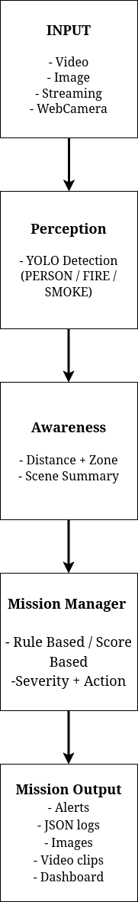
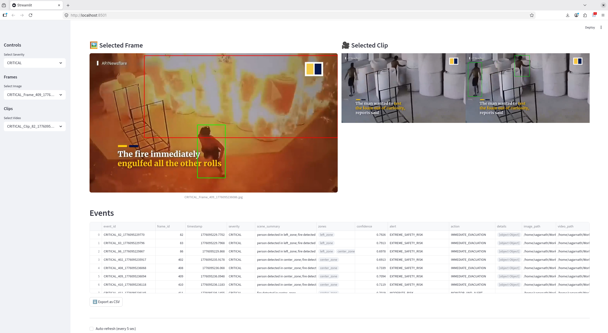

# Fire & Smoke Monitoring System (AI-Based)

---

## Overview

An end-to-end **AI-powered safety monitoring system** that detects **fire, smoke, and human presence** in real-time video streams and generates **mission-level decisions** with alerts, severity scoring, and visual evidence.

## This system converts raw visual perception into **mission-aware decisions with contextual scene understanding**, not just object detection.

## System Pipeline

Input (Video/Image)
↓
Detection (YOLO: Person, Fire, Smoke)
↓
Awareness (Spatial reasoning + hazard zones)
↓
Mission Manager (Rules / Scoring)
↓
Output (Alerts, Images, Video Clips, Dashboard)

---

## Features

- 🔥 Fire & Smoke Detection (Custom YOLO)
- 🧍 Person Detection with Tracking
- 📐 Spatial Awareness (distance + hazard zones)
- ⚠️ Mission-Level Decision Engine
  - Rule-based
  - Scoring-based
- 🎥 Automatic Video Clip Recording (H264)
- 🖼️ Frame Capture (High/Critical events)
- 📊 Interactive Dashboard (Streamlit)
- 🧾 Event Logging (JSON + CSV export)
- 🔄 Temporal Smoothing (stable predictions)

---

## Architecture



---

## Assumptions

### Robot Platform

- Assumed a quadruped robot (robodog) for inspection tasks
- Chosen due to stability in industrial environments and ability to navigate uneven terrain

### Target Environment

- Warehouse / factory inspection setting
- Includes zones such as conveyor belts, storage areas, and utility corridors

### Sensors

- RGB camera used as primary sensor
- No thermal or depth sensors used (can be extended in production)

### Simulation vs Real Deployment

- System uses prerecorded video (YouTube / sample footage)
- Simulates real-world inspection scenarios
- Designed to be deployable on live camera feeds

### Zone Definition

- Frame is divided into:
  - left_zone
  - center_zone
  - right_zone
- Used for generating scene-level contextual summaries

---

## Core Components

### Detection

- YOLO-based detection for:
  - Person
  - Fire
  - Smoke
- Tracking enabled for person IDs

---

### Awareness

- Bounding box normalization
- Distance computation
- Hazard zone generation
- Person–fire interaction logic

---

### Mission Manager

#### Rule-Based

- Deterministic safety logic
- Example:
  - Person inside fire → **CRITICAL**

#### Scoring-Based

- Weighted scoring system
- Example:
  - Fire (+3), Smoke (+2), Person (+1)

---

### Input Support

- Video files
- Images
- Webcam
- RTSP streams

---

### Dashboard

- Severity filtering (CRITICAL / HIGH / MEDIUM / LOW)
- Image & video viewer
- Event table (DataFrame)
- CSV export
- Auto-refresh



---

## Visualization

| Object | Color     |
| ------ | --------- |
| Person | 🟢 Green  |
| Fire   | 🔴 Red    |
| Smoke  | 🟠 Orange |

---

## Limitations

- Smoke detection can be affected by lighting conditions and may be confused with bright regions or haze.
- Fire detection may be less accurate in overexposed or low-light scenarios.
- Zone mapping is based on image coordinates and not real-world calibrated positions.
- The system currently uses only RGB input; additional sensors like thermal cameras can improve robustness.
- Temporal smoothing may introduce slight delays in triggering alerts.

---

## Scene Understanding

The system generates contextual summaries such as:

- "Fire detected in center_zone"
- "Person near smoke in left_zone"

This enables the system to move beyond detection and provide meaningful situational awareness.

---

## Sample Mission Output

```json
{
    "event_id": "CRITICAL_82_1776095229770",
    "frame_id": 82,
    "timestamp": 1776095229.7701561,
    "severity": "CRITICAL",
    "scene_summary": "person detected in left_zone; fire detected in left_zone",
    "zones": [
      "left_zone"
    ],
    "confidence": 0.7926347404718399,
    "alert": "EXTREME_SAFETY_RISK",
    "action": "IMMEDIATE_EVACUATION",
    "details": [
      {
        "person_id": 1,
        "event": "inside_fire_zone"
      }
    ],
    "image_path": "/home/sagarnath/Workspace/NTT_Assessment/Inference/images/CRITICAL_Frame_82_1776095229758.jpg",
    "video_path": "/home/sagarnath/Workspace/NTT_Assessment/Inference/videos/CRITICAL_Clip_82_1776095229762_h264.mp4"
  },

---

## Scaling to Production

- Streaming ingestion using Kafka or message queues
- Model serving via APIs (FastAPI / Triton)
- Asynchronous processing pipelines
- Monitoring using Prometheus and Grafana
- Integration with alerting systems (alarms, notifications)

---

## Installation

```bash
git clone https://github.com/bibekjyotinath/Fire-Smoke-Monitoring-System-AI-Based-.git
cd Fire-Smoke-Monitoring-System-AI-Based-
pip install -r requirements.txt

---

## Run Pipeline

python main.py \
  --source "<path to video, streaming, webcamera or image>" \
  --mode scoring

---

## Run Dashboard

streamlit run dashboard/dashboard.py
```
